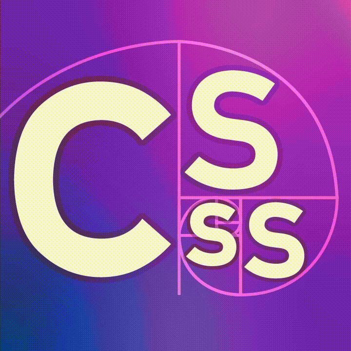

#  CSSS Website

This is the wesbite for the Computer Science Student's Society at the University of Saskatchewan. It is built using the [Grav CMS](https://getgrav.org/). The full documentation can be found from [learn.getgrav.org](https://learn.getgrav.org).

# Requirements

- PHP 7.3.6 or higher. Check the [required modules list](https://learn.getgrav.org/basics/requirements#php-requirements)
- Check the [Apache](https://learn.getgrav.org/basics/requirements#apache-requirements) or [IIS](https://learn.getgrav.org/basics/requirements#iis-requirements) requirements

# Set Up

https://github.com/chii-vu/csss-site/assets/115325256/75cba7b4-3259-4bb8-b27d-93992b0bcfde


Get the site up and running:

### Clone the repository
   
```bash 
$ git clone https://github.com/chii-vu/csss-site.git
$ cd csss-site
```

### Install dependencies
   
```bash
$ bin/grav composer
```

### Run the site locally

```bash
$ bin/grav server
```

Visit the site at [localhost:8000](http://localhost:8000).

# Contributing

## Workflow

- Create a new branch for your feature
- Make your changes
- Create a pull request to merge your branch into `dev`

### Branching

- `main` is the main branch
- `dev` is the development branch
- `feature/<feature-name>` is the branch for a new feature

### Pull Requests

- Create a pull request from your feature branch to `dev`
- Pull requests must be approved by at least Chi, Ruan, or Amanda before being merged into `dev`

### Code Style

- Prettier is used to format the code
- ESLint is used to lint the code
- PHP Code Sniffer is used to lint the PHP code
